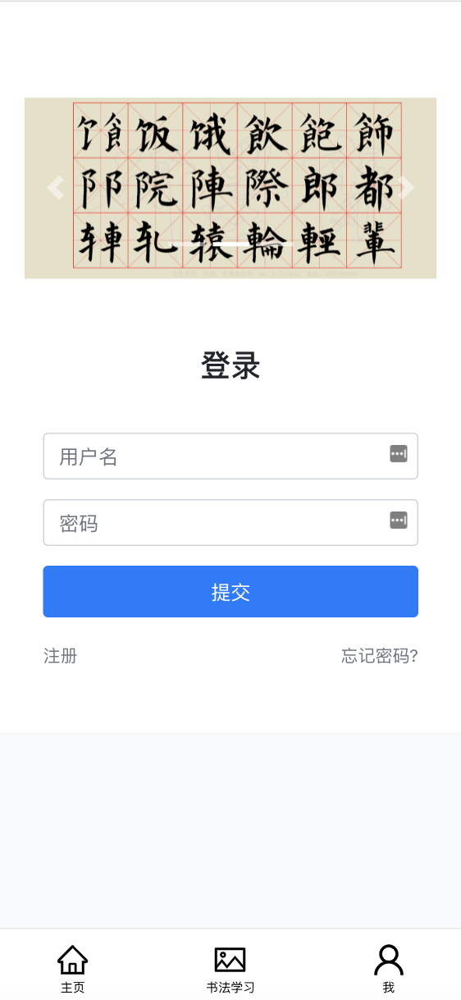
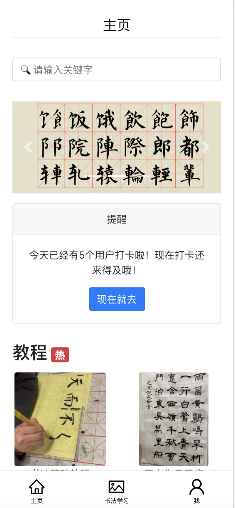
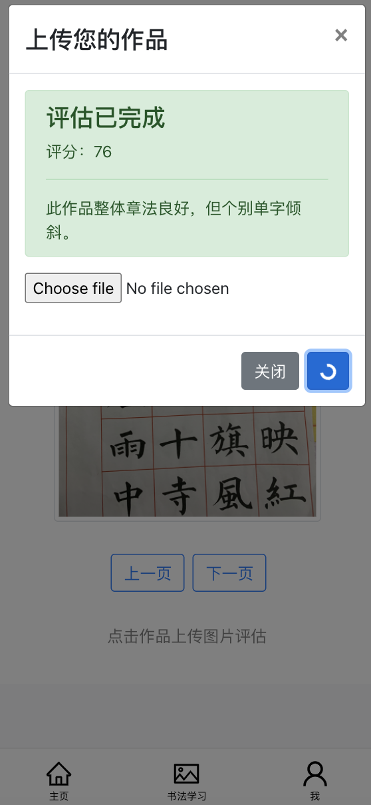
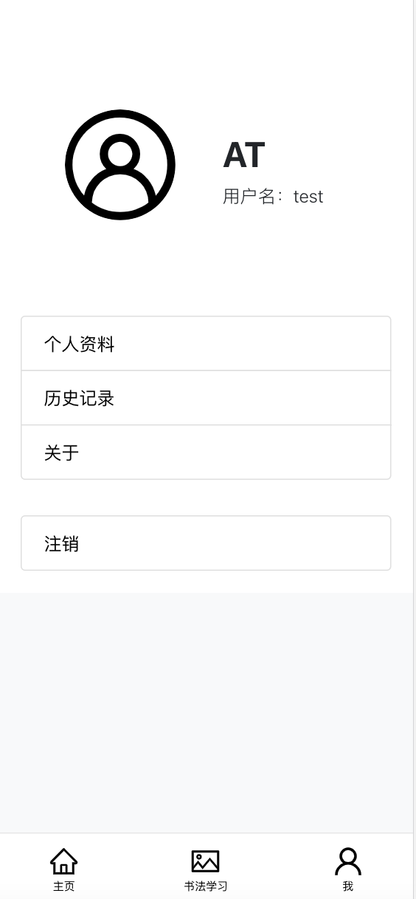
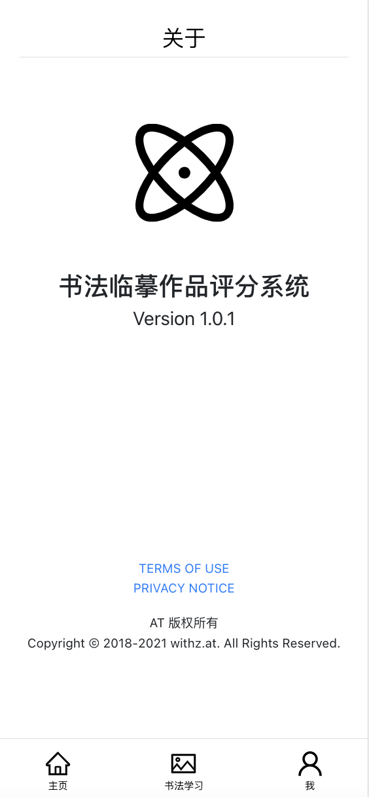

# CE_Frontend
This repo is for demenstration only and contains no code for communication between frond and back end.

The project is a PWA programme which is a type of application software delivered through the web, built using common web technologies including HTML, CSS and JavaScript. It is intended to work on any platform that uses a standards-compliant browser, including both desktop and mobile devices.

# Requirements
1. Node.js >= v12.11.0
2. npm >= 6.11.3

# How to use?
1. Run `npm install` in the extracted folder
2. Run `npm start` to view the project

# Preview

